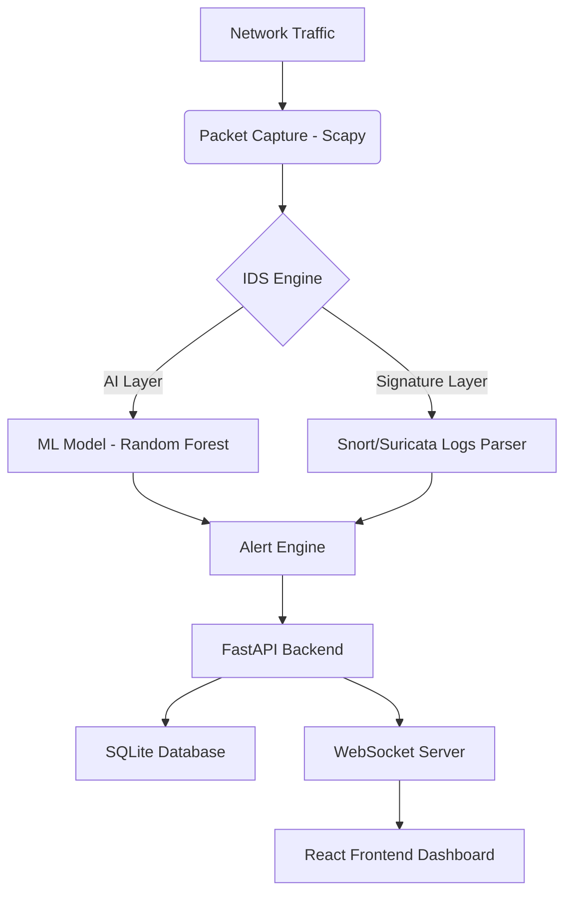
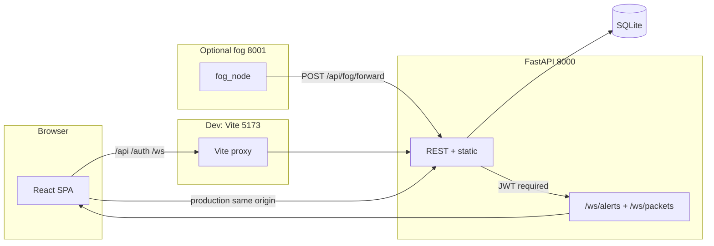

# LightGuard IDS

LightGuard is a resource-conscious Intrusion Detection System (IDS) that combines signature-based detection and AI anomaly detection. It features a real-time React dashboard for monitoring network activity, visualizing threats, and managing security alerts.

## Features

- **Hybrid Detection**:
  - **Signature-based (Snort/Suricata)**: Parses existing logs from Snort or Suricata to identify known attack patterns.
  - **AI Anomaly Detection (Machine Learning)**: Uses a pre-trained `RandomForestClassifier` trained on the NSL-KDD dataset to detect zero-day or unusual activity in live packet captures.
- **Real-time Monitoring**:
  - WebSocket-powered dashboard for live alert streaming.
  - Authenticated live packet stream via `/api/packets/live` and `/ws/packets?token=<JWT>`.
  - Visualize network stats (protocols, severities, event counts) with Recharts.
- **GNS3 / Wireshark Demo Integration**:
  - `scripts/gns3_traffic_feeder.py` ingests GNS3-mapped packets or PCAP replay into LightGuard.
  - Wireshark remains the external packet inspection tool while LightGuard shows matching packets, alerts, logs, and topology animation.
- **Network Scanner**: Periodically scans the configured network for active devices.
- **Role-Based Access Control (RBAC)**: Supports SOC Admin, SOC Analyst, Monitoring Staff, Technical Staff, and Read-Only Viewer roles with JWT authentication.
- **Resource Optimized**: Designed with low RAM usage targets (< 400MB) for efficient operation.

## Architecture

### High-level data path



### Deployment & client ↔ server topology



### Where to read the full network map

- **Topology page (`/topology`)**: live React Flow graph from `GET /api/network/topology`, with animated attack edges driven by `WebSocket /ws/alerts`.
- **Written reference (English, HTTP routes, dev vs prod ports, fog flow, Topology UI):** [`docs/NETWORK_TOPOLOGY_AND_FLOWS.md`](docs/NETWORK_TOPOLOGY_AND_FLOWS.md).

## Technology Stack

- **Backend**: Python 3.9+, FastAPI, SQLAlchemy, Scapy, Scikit-learn, Watchdog, JWT (JOSE/Passlib).
- **Frontend**: React (Vite), Tailwind CSS, Framer Motion, Lucide React, Recharts.
- **Database**: SQLite (SQLAlchemy ORM).
- **Machine Learning**: RandomForestClassifier, NSL-KDD dataset, Scikit-learn.

## Prerequisites

- **OS**: Linux (recommended for full IDS features), macOS (limited Snort support).
- **System Tools**: `python3`, `node.js` (npm), `libpcap-dev`, `masscan`, `nmap`.
- **IDS Components**: `snort` or `suricata` (for signature-based detection).

## Quick start (copy-paste)

أوامر جاهزة للنسخ: بعد [التثبيت](#installation) مرة واحدة، من **جذر المستودع** (`Ghassan/`):

### وضع التطوير (واجهة + API)

**طرفية 1 — الخلفية:**

```bash
source venv/bin/activate && python3 scripts/migrate_sqlite.py && uvicorn backend.main:app --host 0.0.0.0 --port 8000
```

**طرفية 2 — الواجهة:**

```bash
cd frontend && npm run dev
```

ثم افتح الواجهة على [http://localhost:5173](http://localhost:5173) (Vite يوجّه `/api` و`/auth` و`/ws` تلقائياً إلى المنفذ 8000).

### تشغيل من منفذ واحد (8000)

بعد `npm install` داخل `frontend/` مرة واحدة:

```bash
cd frontend && npm run build && cd .. && source venv/bin/activate && uvicorn backend.main:app --host 0.0.0.0 --port 8000
```

ثم [http://localhost:8000](http://localhost:8000).

### بديل: سكربت التشغيل

```bash
chmod +x scripts/start.sh && ./scripts/start.sh
```

(يفعّل `venv` ويحمّل `config/lightguard.env` إن وُجد؛ تأكد أنك بنيت الواجهة سابقاً إذا أردت الواجهة من نفس المنفذ.)

## Installation

You can use the provided automated installation script:

```bash
chmod +x scripts/install.sh
./scripts/install.sh
```

Alternatively, perform the steps manually:

1.  **Backend Setup**:

    ```bash
    python3 -m venv venv
    source venv/bin/activate
    pip install -r backend/requirements.txt
    python3 scripts/migrate_sqlite.py
    ```

2.  **ML Model Training**:

    ```bash
    # Ensure you have the NSL-KDD dataset in ml/
    python3 ml/train.py
    ```

3.  **Frontend Build**:

    ```bash
    cd frontend
    npm install
    npm run build
    cd ..
    ```

4.  **Network Permissions**:
    If running on Linux, grant Python permission to capture packets without sudo:
    ```bash
    sudo setcap cap_net_raw,cap_net_admin+eip $(which python3)
    ```

## Usage

للأوامر الجاهزة للنسخ (تطوير أو منفذ واحد) راجع [Quick start (copy-paste)](#quick-start-copy-paste).

**تشغيل الخلفية فقط** (الواجهة مبنية مسبقاً في `backend/static`):

```bash
source venv/bin/activate
uvicorn backend.main:app --host 0.0.0.0 --port 8000
```

لوحة التحكم: [http://localhost:8000](http://localhost:8000)

### Default Credentials

- **SOC Admin**: `admin` / `lightguard123`
- **SOC Analyst**: `analyst` / `analyst123`
- **Monitoring Staff**: `monitor` / `monitor123`
- **Technical Staff**: `technical` / `technical123`
- **Read-Only Viewer**: `viewer` / `viewer123`

## SQLite Migration

LightGuard keeps SQLite and uses a compatibility migration script instead of Alembic. Run it before demos or after schema changes:

```bash
source venv/bin/activate
python3 scripts/migrate_sqlite.py
```

The script calls `backend.database.init_db()`, creates missing tables such as `packet_events`, and adds backward-compatible columns without deleting existing alerts, devices, or users.

## GNS3 + Wireshark Demo

1. Start backend and frontend from [Quick start](#quick-start-copy-paste).
2. Open GNS3 project `gns3/LightGuard_Tadhamon.gns3`.
3. Start Wireshark on the SPAN/TAP or bridge interface and use a focused filter:
   ```text
   ip.addr == 192.168.99.20 || tcp.port == 554 || tcp.port == 22
   ```
4. Trigger demo traffic:
   ```bash
   source venv/bin/activate
   python3 scripts/gns3_traffic_feeder.py \
     --url http://127.0.0.1:8000 \
     --login --username admin --password lightguard123 \
     --attack mixed --count 20 --interval 0.5
   ```
5. Expected timing: packets appear in `/live-packets` immediately, matching alerts/logs within 1-2 seconds, and topology live arrows fade after about 5 seconds.
6. Fallback if GNS3 is not available:
   ```bash
   python3 scripts/gns3_traffic_feeder.py --url http://127.0.0.1:8000 --login --attack port_scan --count 10
   ```
   Or replay a PCAP when Scapy is installed:
   ```bash
   python3 scripts/gns3_traffic_feeder.py --url http://127.0.0.1:8000 --login --pcap sample_attack.pcap
   ```

WebSocket note: browser clients pass the JWT as a query parameter, for example `/ws/packets?token=<JWT>`. Connections without a valid token are rejected with WebSocket policy violation code `1008`.

## Configuration

Settings can be managed via `config/lightguard.env`:

- `NETWORK_INTERFACE`: Network interface to monitor (e.g., `eth0`, `wlan0`).
- `NETWORK_CIDR`: Target network for scanning (e.g., `192.168.1.0/24`).
- `SCAN_INTERVAL`: Interval between network scans in seconds.
- `MASSCAN_RATE`: Packet rate for `masscan` (default: `1000`).
- `MOCK_MODE`: Set to `True` for testing without live traffic or Snort logs.
- `SNORT_LOG` / `SURICATA_LOG`: Paths to signature-based alert log files.
- `JWT_SECRET`: Secret key for JWT token generation.
- `API_HOST` / `API_PORT`: Host and port for the FastAPI server.

## Thesis / Chapter 5

- **Checklist mapped to repo:** [`docs/LIGHTGUARD_CHAPTER5_CHECKLIST_FILLED.md`](docs/LIGHTGUARD_CHAPTER5_CHECKLIST_FILLED.md) (Arabic + English headings).
- **Metrics JSON for evaluation:** authenticated `GET /api/stats/evaluation-summary` (CPU/RAM, alert totals, FP rate, embedded `ml/training_metrics.json` after `python3 ml/train.py`).
- **Smoke tests:** `python -m pytest tests/test_lightguard_smoke.py -v`

## Deployment

A systemd service file is provided in `scripts/lightguard.service` for high availability on Linux systems.

1. التطوير (واجهة منفصلة + API)
   تحتاج طرفيتين من جذر المشروع `lightguard/`:

الخلفية (من جذر المشروع):

cd lightguard
python3 -m venv venv
source venv/bin/activate
pip install -r backend/requirements.txt
uvicorn backend.main:app --host 0.0.0.0 --port 8000
الواجهة:

cd lightguard/frontend
npm install # مرة واحدة إن لم تكن ثبّتّ الحزم
npm run dev

---

## New Features (v2)

### Feature 1 — Adaptive Optimization Engine

Automatically tunes the anomaly detection threshold over time based on admin feedback.

**How it works:**

- A background thread (`backend/ids/adaptive_optimizer.py`) runs every **30 minutes**.
- It reads the last 200 alerts and calculates the false-positive (FP) rate.
- If FP rate > 20% → threshold raised by 5% (reduce sensitivity).
- If FP rate < 5% → threshold lowered by 5% (increase sensitivity).
- Current threshold and last-tuned time are shown on the Dashboard and in Settings.

**Usage:**

- In the **Alerts** page, admin users can click **Mark FP** on any row to flag it as a false positive.
- The optimizer reads these flags on its next cycle.

**API:**

```
GET  /api/detection-config          # returns threshold, last_tuned, fp_rate, active_model
POST /api/alerts/{id}/false-positive  # admin only — marks alert as FP
```

---

### Feature 2 — Brute-Force & SQL Injection Detection

Extends the IDS engine with two new signature-based attack detectors.

**Brute-Force Detector (`backend/ids/attack_patterns.py`):**

- Tracks failed login attempts per IP in memory (60-second TTL window).
- Fires a HIGH-severity `BRUTE_FORCE` alert when an IP exceeds 5 failures in 60 seconds.
- Frontend or internal services report failures via:
  ```
  POST /api/ids/report-login-failure   body: { "ip": "x.x.x.x" }
  ```

**SQL Injection Detector:**

- `SQLiMiddleware` is attached to the FastAPI app and inspects all POST/PUT/PATCH request bodies.
- Patterns checked: `' OR '1'='1`, `; DROP TABLE`, `UNION SELECT`, `--`, `xp_cmdshell`.
- Fires a CRITICAL-severity `SQL_INJECTION` alert with payload snippet on match.
- The request is never blocked — detection is passive/forensic.

---

### Feature 3 — TLS / Data Encryption

Alert payload data (`raw_payload`) is encrypted at rest using symmetric Fernet encryption.

**Encryption (`backend/security/encryption.py`):**

- Uses Python `cryptography` library (Fernet / AES-128-CBC).
- Key is loaded from `LIGHTGUARD_ENCRYPTION_KEY` in `config/lightguard.env`.
- If the key is missing on first run, one is automatically generated and saved.
- Old unencrypted rows are decoded gracefully (backwards compatible).

**Dashboard:** A green "Encrypted Storage: Active" badge appears in the top-right status bar.

**HTTPS Setup (production):**

Generate a self-signed certificate:

```bash
openssl req -x509 -newkey rsa:4096 -keyout key.pem -out cert.pem -days 365 -nodes \
  -subj "/CN=lightguard-tadhamon"
```

Start with TLS:

```bash
uvicorn backend.main:app --host 0.0.0.0 --port 8443 \
  --ssl-keyfile key.pem --ssl-certfile cert.pem
```

Then access at `https://localhost:8443` (accept the browser's self-signed cert warning).

---

### Feature 4 — Fog Node Simulation

Simulates a distributed IoT→Fog→Cloud edge architecture for Tadhamon Smart City — no hardware required.

**Architecture:**

```
IoT Devices  →  Fog Nodes (:8001)  →  LightGuard IDS (:8000)
traffic_sensor     Zone A (Transportation)     Main alerts DB
energy_meter       Zone B (Energy Grid)        WebSocket broadcast
security_camera    Zone C (Public Safety)
env_sensor
```

**Starting the fog node server:**

**نسخ ولصق (من جذر المستودع `Ghassan/` بعد [التثبيت](#installation):** طرفية واحدة؛ يشغّل محاكي Fog على **8001** بشكل مستقل عن الخادم الرئيسي.

```bash
source venv/bin/activate && python start_fog_node.py
```

**Windows (PowerShell):** `venv\Scripts\Activate.ps1` ثم `python start_fog_node.py`.

(Runs on port **8001**; for forwarded HIGH/CRITICAL alerts to appear in LightGuard, keep the main API running on **8000**.)

**How it works:**

- `POST /fog/ingest` receives IoT device data with any of: `packets_per_sec`, `bandwidth_mbps`, `voltage`, `temperature`.
- Signature rules are applied locally:
  - `HIGH_TRAFFIC_SPIKE` (packets/s > 800) → **HIGH** severity
  - `ABNORMAL_TEMP` (temp > 80°C) → **MEDIUM** severity
  - `VOLTAGE_SPIKE` (voltage > 260V) → **CRITICAL** severity
  - `CAMERA_PACKET_FLOOD` (bandwidth > 90 Mbps) → **HIGH** severity
- LOW/MEDIUM alerts → logged to `fog_node_log.json` at the project root.
- HIGH/CRITICAL alerts → forwarded to `POST /api/fog/forward` on the main server.

**Frontend:** The **Fog Nodes** page shows live status for all 3 zones with a "Simulate Traffic" button per node.

---

### Feature 5 — TFLite Detection Model

A lightweight neural network alternative to the RandomForest model, optimised for edge/fog deployment.

**Training:**

```bash
# Requires tensorflow installed
python -m ml.tflite_model.train_tflite
```

Saves `ml/tflite_model/model.tflite` and `ml/tflite_model/scaler.pkl`.
Falls back to synthetic data if the NSL-KDD dataset is not present.

**Switching models at runtime:**

- In the **Settings** page (admin only), toggle between **RandomForest** and **TFLite**.
- Or via API:
  ```
  PATCH /api/detection-config/model   body: { "model": "tflite" }
  ```
- Alternatively, set `USE_TFLITE=true` in `config/lightguard.env` before starting the server.

**Fallback:** If `model.tflite` is not found or no TFLite runtime is installed, the engine automatically falls back to the RandomForest model.

**Installing TFLite runtime (lightweight, no full TF):**

```bash
pip install tflite-runtime
```

---

Built by Ghassan Said Ghassan AlMazruii
