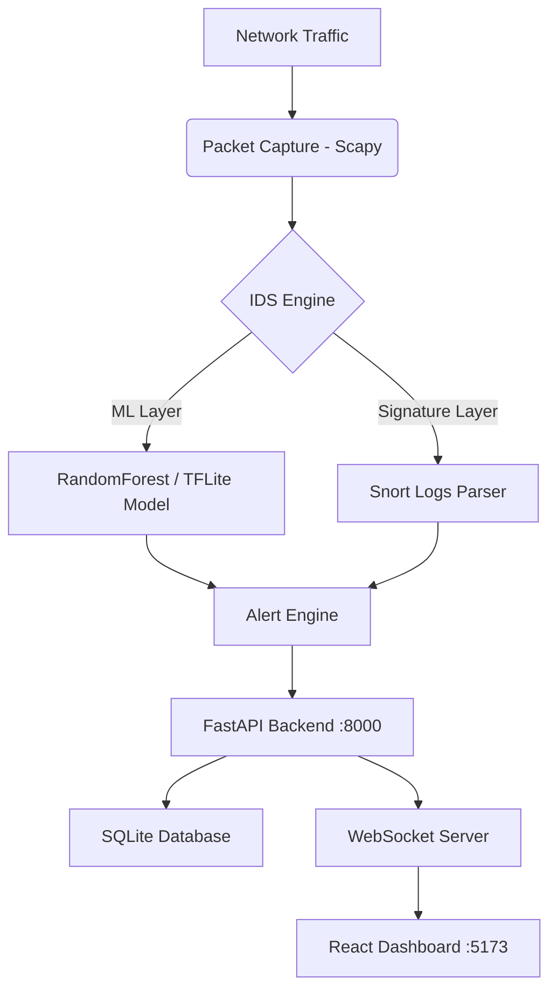
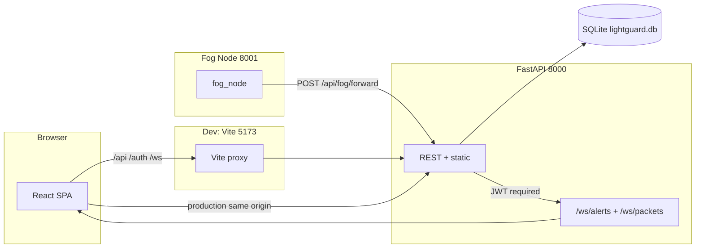

# LightGuard IDS
### A Resource-Conscious Intrusion Detection System for Smart IoT Environments
**Tadhamon Smart City — Oman Vision 2040**

> **Student:** Ghassan Said Ghassan AlMazruii (11F8254)  
> **Supervisor:** Mr. Abdullah Abbasi  
> **Institution:** Middle East College, Knowledge Oasis Muscat, Oman  
> **Specialisation:** Computer Engineering — Cyber Security  
> **Methodology:** Cisco PPDIOO | **Standard:** NIST SP 800-207 Zero Trust

---

## Features

- **Hybrid Detection Engine:**
  - **Signature-based (Snort):** Parses Snort alert logs (`/var/log/snort/alert`) to identify known attack patterns — ARP Spoofing, Port Scan, SSH Brute Force, ICMP Flood, DNS Tunnelling, MQTT Unencrypted.
  - **ML Anomaly Detection:** Uses a pre-trained `RandomForestClassifier` (99.2% accuracy on NSL-KDD) to detect unusual network activity. Switchable to TFLite at runtime.

- **Real-time Monitoring:**
  - WebSocket-powered dashboard for live alert streaming (`/ws/alerts`).
  - Live packet stream via `/api/packets/live` and `/ws/packets?token=<JWT>`.
  - Visualize network stats (protocols, severities, 24-hour heatmap) with Recharts.

- **Fog Computing Architecture:**
  - Fog Node server (`start_fog_node.py`) runs on port **8001** independently.
  - Processes LOW/MEDIUM alerts locally; forwards HIGH/CRITICAL to Central IDS.
  - 3 zones: Zone A (Transportation), Zone B (Energy Grid), Zone C (Public Safety).
  - Reduces CPU load to ~18% vs ~80% for cloud-only approach.

- **GNS3 / Wireshark Integration:**
  - `scripts/gns3_traffic_feeder.py` sends simulated attack traffic to LightGuard.
  - GNS3 topology: 56 nodes, 56 links, 6 VLANs, 18 devices with static IPs via `startup.vpc`.
  - Wireshark captures live packets on GNS3 links for forensic verification.

- **Security Controls (Defense-in-Depth — 5 Layers):**
  - JWT HS256 authentication (24-hour expiry).
  - RBAC with 3 roles: Admin, Analyst, Viewer.
  - Fernet AES-128-CBC encryption of alert payloads at rest.
  - TOTP MFA (RFC 6238) via Google Authenticator / Authy.
  - ACL Firewall Rules with VLAN segmentation (6 VLANs).

- **Adaptive Optimizer:**
  - Background thread tunes anomaly threshold every 30 minutes.
  - Raises threshold if FP rate > 20%; lowers if FP rate < 5%.

- **Resource Optimised:** Designed for IoT environments — CPU ~18%, RAM ~280 MB (target < 512 MB).

---

## Architecture

### High-level data path



### Deployment topology



---

## Technology Stack

| Layer | Technology |
|-------|-----------|
| **Backend** | Python 3.11, FastAPI, SQLAlchemy, Uvicorn |
| **IDS Engine** | Scapy, Scikit-learn (RandomForest), TFLite (optional) |
| **Security** | python-jose (JWT HS256), passlib (pbkdf2_sha256), cryptography (Fernet), pyotp (TOTP) |
| **Frontend** | React 18, Vite, Tailwind CSS, Framer Motion, Recharts |
| **Database** | SQLite (SQLAlchemy ORM) |
| **ML Dataset** | NSL-KDD (41 features, RandomForestClassifier) |
| **Simulation** | GNS3, Wireshark |
| **AI Chat** | Google Gemini API |
| **Project Mgmt** | ProjectLibre (Gantt + WBS) |

---

## Prerequisites

| Requirement | Version | Notes |
|-------------|---------|-------|
| Python | **3.11** | Tested on 3.11.9 |
| Node.js | 18 or later | For React frontend |
| GNS3 | 2.2 or later | Optional — for full network simulation |
| Wireshark | Any | Optional — for packet inspection |

> **Windows users:** Scapy requires Npcap. Install from https://npcap.com  
> **Linux users:** `sudo setcap cap_net_raw,cap_net_admin+eip $(which python3)` for Scapy without root.

---

## How to Run

### Quick start (one command)

```powershell
# From project root (Windows)
cd C:\Users\Ghass\Downloads\lightguard11
py -3.11 run.py
```

Open: **http://localhost:8000**

### Development mode (separate frontend)

**Terminal 1 — Backend:**
```powershell
cd C:\Users\Ghass\Downloads\lightguard11
py -3.11 run.py
```

**Terminal 2 — Frontend (hot-reload):**
```powershell
cd C:\Users\Ghass\Downloads\lightguard11\frontend
npm install
npm run dev
```

Open: **http://localhost:5173** (Vite proxies `/api`, `/auth`, `/ws` to port 8000)

### Run with GNS3 (real network mode)

```powershell
py -3.11 run.py --real
```

Sets `MOCK_MODE=false` and scans `192.168.99.0/24`.

### Start Fog Node (separate terminal)

```powershell
cd C:\Users\Ghass\Downloads\lightguard11
py -3.11 start_fog_node.py
```

Runs on port **8001**. Keep main backend running on **8000**.

### Run Automated Tests

```powershell
cd C:\Users\Ghass\Downloads\lightguard11
py -3.11 -m pytest tests/test_lightguard_smoke.py -v
```

Expected:
```
PASSED tests/test_lightguard_smoke.py::test_health_login_evaluation_summary
1 passed in X.XXs
```

---

## Default Login Credentials

| Role | Username | Password | Permissions |
|------|----------|----------|-------------|
| SOC Admin | `admin` | `lightguard123` | Full access — all pages, settings, users |
| SOC Analyst | `analyst` | `analyst123` | Read + Mark FP + view alerts |
| Read-Only Viewer | `viewer` | `viewer123` | Dashboard and alerts — read only |

---

## Configuration

Settings in `config/lightguard.env` (copy from `config/lightguard.env.example`):

| Variable | Default | Description |
|----------|---------|-------------|
| `MOCK_MODE` | `true` | `true` = no Scapy capture (safe for demo) / `false` = live capture |
| `NETWORK_CIDR` | `192.168.99.0/24` | Subnet for SocketScanner |
| `NETWORK_INTERFACE` | `eth0` | Network interface for Scapy capture |
| `SCAN_INTERVAL` | `3600` | Seconds between network scans |
| `JWT_SECRET` | auto | Change in production |
| `JWT_EXPIRE_HOURS` | `24` | JWT token lifetime |
| `SNORT_LOG` | `/var/log/snort/alert` | Path to Snort alert log |
| `GEMINI_API_KEY` | pre-filled | Google Gemini AI key |
| `LIGHTGUARD_ENCRYPTION_KEY` | auto-generated | Fernet AES-128-CBC key (saved on first run) |

---

## GNS3 + Wireshark Demo

```
1. Start backend: py -3.11 run.py
2. Open GNS3 → File → Open Project → gns3/LightGuard_Tadhamon.gns3
3. Click ▶ Start all nodes — wait for green indicators
4. Wireshark: right-click any link → Start capture
```

Wireshark filter for demo:
```
ip.addr == 192.168.99.20 || tcp.port == 554 || tcp.port == 22
```

Trigger demo traffic (disable MFA first — see below):
```powershell
# Get token
$r = Invoke-RestMethod -Uri "http://localhost:8000/auth/login" `
  -Method POST -Body "username=admin&password=lightguard123" `
  -ContentType "application/x-www-form-urlencoded"
$token = $r.access_token

# Run SSH Brute Force attack
py -3.11 scripts\gns3_traffic_feeder.py --token $token --attack ssh_bruteforce --count 15 --interval 0.3

# Mixed attack (all types)
py -3.11 scripts\gns3_traffic_feeder.py --token $token --attack mixed --count 20 --interval 0.5
```

> **⚠️ Note:** If MFA is enabled on the admin account, the token request above will return `mfa_required: true` instead of `access_token`. Disable MFA first via Settings page → DISABLE MFA button, or via:  
> ```powershell
> py -3.11 -c "from backend.database import SessionLocal, User; db=SessionLocal(); u=db.query(User).filter(User.username=='admin').first(); u.mfa_secret=None; db.commit()"
> ```

---

## API Endpoints Reference

### Authentication

| Method | Endpoint | Description |
|--------|----------|-------------|
| POST | `/auth/login` | Login — returns `access_token` or `mfa_required: true` |
| POST | `/auth/login/verify` | Complete MFA login — body: `{temp_token, totp_code}` |
| POST | `/auth/mfa/setup` | Generate TOTP secret + QR code |
| POST | `/auth/mfa/verify` | Confirm OTP to activate MFA |
| POST | `/auth/mfa/disable` | Disable MFA for current user |
| GET | `/auth/mfa/status` | Check if MFA is enabled for current user |

### Core API

| Method | Endpoint | Description |
|--------|----------|-------------|
| GET | `/api/alerts` | List alerts with filter/sort/pagination |
| POST | `/api/alerts/{id}/false-positive` | Mark alert as False Positive |
| GET | `/api/alerts/export/csv` | Export all alerts as CSV |
| GET | `/api/stats/evaluation-summary` | System metrics (CPU, RAM, FP rate) |
| GET | `/api/detection-config` | Current threshold, model, last-tuned |
| PATCH | `/api/detection-config/model` | Switch ML model: `randomforest` or `tflite` |
| GET | `/api/network/topology` | Network topology data for Topology page |
| POST | `/api/packets/ingest` | Ingest packet from GNS3 feeder |
| GET | `/api/fog/status` | Fog node zones status |
| POST | `/api/fog/forward` | Receive HIGH/CRITICAL from Fog Node |
| POST | `/api/ids/report-login-failure` | Report failed login for brute-force detection |

### WebSocket

| Endpoint | Description |
|----------|-------------|
| `/ws/alerts` | Live alert stream — JWT via `?token=<JWT>` or `Authorization: Bearer` header |
| `/ws/packets` | Live packet stream — same auth |

> Connections without valid JWT are rejected with WebSocket code **1008** (Policy Violation).

---

## New Features (Final Implementation)

### Feature 1 — Adaptive Optimization Engine
- Background thread (`backend/ids/adaptive_optimizer.py`) runs every **30 minutes**.
- Reads last **200 alerts**, calculates FP rate.
- FP > 20% → threshold +5% (less sensitive). FP < 5% → threshold -5% (more sensitive).
- View in Settings page: current threshold + last-tuned timestamp.

### Feature 2 — Brute-Force & SQL Injection Detection
- **Brute-Force:** Tracks failed logins per IP (60-second window, 5 failures → HIGH alert).
- **SQL Injection (SQLiMiddleware):** Inspects all POST/PUT/PATCH bodies — patterns: `' OR '1'='1`, `; DROP TABLE`, `UNION SELECT`, `--`, `xp_cmdshell` → CRITICAL alert.

### Feature 3 — Fernet Encryption at Rest
- `raw_payload` encrypted with Fernet (AES-128-CBC + HMAC-SHA256).
- Key auto-generated and stored in `config/lightguard.env`.
- Old unencrypted rows decoded gracefully (backward compatible).

### Feature 4 — Fog Node Simulation
```
IoT Devices → Fog Nodes (:8001) → LightGuard IDS (:8000)
```
Rules applied at Fog layer:

| Rule | Condition | Severity | Action |
|------|-----------|----------|--------|
| HIGH_TRAFFIC_SPIKE | packets/s > 800 | HIGH | Forward to Central IDS |
| ABNORMAL_TEMP | temp > 80°C | MEDIUM | Forward to Central IDS |
| VOLTAGE_SPIKE | voltage > 260V | CRITICAL | Forward to Central IDS |
| CAMERA_PACKET_FLOOD | bandwidth > 90 Mbps | HIGH | Forward to Central IDS |
| All others | LOW/MEDIUM | LOW/MED | Log locally to fog_node_log.json |

### Feature 5 — TFLite Detection Model
- Lightweight neural network alternative to RandomForest.
- Toggle in Settings page (admin only) or via `PATCH /api/detection-config/model`.
- Falls back to RandomForest if `model.tflite` not found.

### Feature 6 — MFA Disable Control *(New in final version)*
- `GET /auth/mfa/status` — Settings page checks MFA state on mount.
- `POST /auth/mfa/disable` — Clears `mfa_secret` + sets `mfa_enabled=False`.
- DISABLE MFA button appears in Settings when MFA is active.

---

## HTTPS Setup (Production)

```bash
openssl req -x509 -newkey rsa:4096 -keyout key.pem -out cert.pem -days 365 -nodes \
  -subj "/CN=lightguard-tadhamon"

uvicorn backend.main:app --host 0.0.0.0 --port 8443 \
  --ssl-keyfile key.pem --ssl-certfile cert.pem
```

Or use the provided script: `./scripts/start_https.sh`

---

## Train ML Model (Optional)

```powershell
# Download NSL-KDD from: https://www.unb.ca/cic/datasets/nsl.html
# Place KDDTrain+.txt in ml/ folder

py -3.11 ml/train.py
# Creates: ml/model.pkl + ml/training_metrics.json
```

---

## Project Information

| Field | Value |
|-------|-------|
| Project Title | LightGuard: A Resource-Conscious Intrusion Detection System for Smart IoT Environments |
| Student | Ghassan Said Ghassan AlMazruii — 11F8254 |
| Supervisor | Mr. Abdullah Abbasi |
| Institution | Middle East College, Knowledge Oasis Muscat, Oman |
| Specialisation | Bachelor's of Computer Engineering — Cyber Security |
| Methodology | Cisco PPDIOO |
| Standard | NIST SP 800-207 Zero Trust Architecture |
| Target Environment | Tadhamon Smart City — Oman Vision 2040 |
| GitHub | https://github.com/ghassanalmazruii92/LightGuard-IDS |

---

*Built by Ghassan Said Ghassan AlMazruii — Middle East College 2026*
