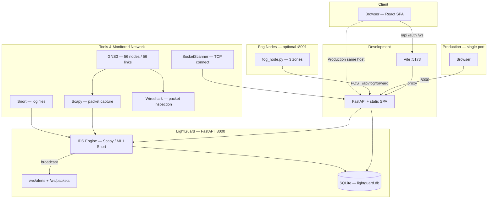
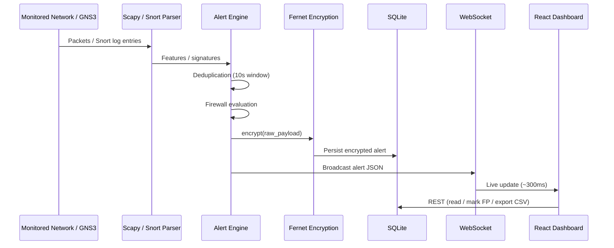
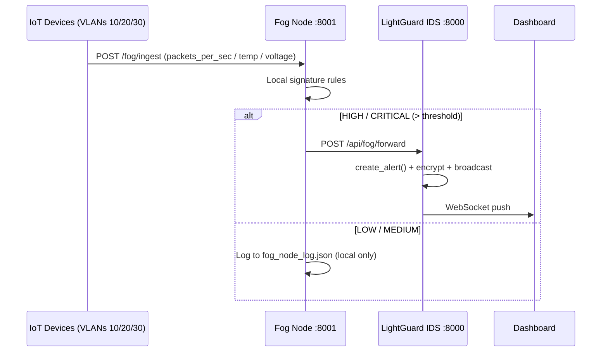

# LightGuard — Topology & Network Flows
## Tadhamon Smart City | Ghassan Said AlMazruii (11F8254) | MEC 2026

This document describes the **logical architecture** for traffic and control paths between the browser, FastAPI, SQLite, the IDS engine, Fog Nodes, and external tools.

---

## 1. Deployment Topology

### Port Reference

| Environment | UI | API |
|-------------|----|----|
| Development | `http://localhost:5173` | Vite proxies `/api`, `/auth`, `/ws` → port 8000; `/fog` → port 8001 |
| Production | — | `http://localhost:8000` (SPA served from `backend/static`) |
| Fog Node | — | `http://localhost:8001` (independent server) |

---

## 2. IDS Data Path — Alert Pipeline

---

## 3. Fog Computing Flow

**Fog Rules:**

| Rule | Condition | Severity | Action |
|------|-----------|----------|--------|
| HIGH_TRAFFIC_SPIKE | packets/s > 800 | HIGH | Forward to Central IDS |
| VOLTAGE_SPIKE | voltage > 260V | CRITICAL | Forward to Central IDS |
| CAMERA_PACKET_FLOOD | bandwidth > 90 Mbps | HIGH | Forward to Central IDS |
| ABNORMAL_TEMP | temp > 80°C | MEDIUM | Forward to Central IDS |
| All others | LOW/MEDIUM | LOW/MED | Log locally |

---

## 4. HTTP & WebSocket Routes

### Authentication & MFA

| Method | Endpoint | Description |
|--------|----------|-------------|
| POST | `/auth/login` | Returns `access_token` or `{mfa_required: true, temp_token}` |
| POST | `/auth/login/verify` | Complete MFA login — body: `{temp_token, totp_code}` |
| POST | `/auth/mfa/setup` | Generate TOTP secret + QR code |
| POST | `/auth/mfa/verify` | Confirm OTP to activate MFA |
| POST | `/auth/mfa/disable` | Disable MFA for current user |
| GET | `/auth/mfa/status` | Check if MFA is enabled |

### Alerts & Logs

| Method | Endpoint | Description |
|--------|----------|-------------|
| GET | `/api/alerts` | List with filter / sort / pagination |
| GET | `/api/alerts/stats` | Alert statistics |
| POST | `/api/alerts/{id}/false-positive` | Mark as FP (admin only) |
| GET | `/api/alerts/export/csv` | Export all alerts as CSV |
| GET | `/api/logs` | SOC event log |
| GET | `/api/stats/system` | CPU, RAM, uptime |
| GET | `/api/stats/evaluation-summary` | Full metrics — alerts, FP rate, ML metrics |

### Devices & Network

| Method | Endpoint | Description |
|--------|----------|-------------|
| GET | `/api/devices` | List 17 IoT devices |
| GET | `/api/devices/stats` | Device statistics |
| GET | `/api/devices/zones` | Devices grouped by VLAN zone |
| GET | `/api/devices/{ip}` | Device detail + CVEs + risk score |
| POST | `/api/devices/scan-network` | Trigger SocketScanner |
| GET | `/api/network/topology` | Full topology data for Topology page |
| GET | `/api/network/vlans` | VLAN list |
| GET/POST/PATCH/DELETE | `/api/network/firewall` | ACL firewall rules |
| POST | `/api/network/ingest` | Ingest external topology data |

### Detection & ML

| Method | Endpoint | Description |
|--------|----------|-------------|
| GET | `/api/detection-config` | threshold, last_tuned, FP rate, active model |
| PATCH | `/api/detection-config/model` | Switch: `randomforest` or `tflite` |
| POST | `/api/ids/report-login-failure` | Report failed login for brute-force detection |

### Scenarios, Fog, AI

| Method | Endpoint | Description |
|--------|----------|-------------|
| GET/POST | `/api/scenarios` | List / create scenarios |
| POST | `/api/scenarios/run` | Execute attack simulation |
| GET | `/api/scenarios/history` | Simulation history |
| POST | `/api/fog/forward` | Receive HIGH/CRITICAL from Fog Node |
| GET | `/fog/status` | Fog zone status (port 8001) |
| POST | `/fog/ingest` | Inject IoT data into Fog Node (port 8001) |
| POST | `/api/ai/chat` | Gemini AI security assistant |

### Users (Admin Only)

| Method | Endpoint | Description |
|--------|----------|-------------|
| GET | `/api/users` | List users |
| POST | `/api/users` | Create user |
| PATCH | `/api/users/{id}` | Update role / password |

### Packets

| Method | Endpoint | Description |
|--------|----------|-------------|
| GET | `/api/packets/live` | Recent live packets |
| POST | `/api/packets/ingest` | Ingest from gns3_traffic_feeder.py |

### WebSocket

| Endpoint | Auth | Description |
|----------|------|-------------|
| `ws://host/ws/alerts` | `?token=<JWT>` or `Authorization: Bearer` | Live alert stream |
| `ws://host/ws/packets` | `?token=<JWT>` | Live packet stream |

> Connections without valid JWT are rejected with **WebSocket code 1008** (Policy Violation).

---

## 5. VLAN Segmentation — 6 Zones

| VLAN | Name | Subnet | Key Devices | Policy |
|------|------|--------|-------------|--------|
| 10 | Transportation | 192.168.10.0/24 | cam-traffic-01/02, traffic-light-ctrl | IoT only — no access to VLAN 99 |
| 20 | Energy Grid | 192.168.20.0/24 | smart-meter-01/02, power-distribution | IoT only — isolated from VLAN 10 |
| 30 | Environmental | 192.168.30.0/24 | env-sensor-air/water, water-pump | IoT only — low risk |
| 40 | Fog Compute | 192.168.40.0/24 | fog-node-01/02/03 | Accepts from VLANs 10/20/30 only |
| 50 | Core Network | 192.168.50.0/24 | gateway-main, switch-core-01 | Network admins only |
| 99 | Management | 192.168.99.0/24 | IDS Server (.10), SOC (.11/.12), SCADA (.20) | Authenticated HTTPS — highest protection |

---

## 6. SQLi Middleware — Passive Detection

`SQLiMiddleware` is attached to the FastAPI app and inspects all `POST`/`PUT`/`PATCH` request bodies.

Patterns detected:
- `' OR '1'='1`
- `; DROP TABLE`
- `UNION SELECT`
- `--` (SQL comment)
- `xp_cmdshell`

On match: fires a **CRITICAL** `SQL_INJECTION` alert. The request is **never blocked** — detection is passive/forensic only.

---

## 7. Security Layers — Defense-in-Depth

| Layer | Implementation | File |
|-------|----------------|------|
| 1. Network Segmentation | 6 VLANs with ACL rules | `backend/api/network_api.py` |
| 2. Perimeter Firewall | Logical ACL evaluation | `backend/ids/alert_engine.py` |
| 3. Authentication | JWT HS256 — 24h expiry | `backend/auth.py` |
| 4. Authorisation | RBAC: Admin / Analyst / Viewer | `backend/auth.py` |
| 5. MFA | TOTP RFC 6238 (pyotp) | `backend/security/mfa.py` |
| 6. Encryption at Rest | Fernet AES-128-CBC + HMAC-SHA256 | `backend/security/encryption.py` |
| 7. IDS Detection | Signature + ML Hybrid | `backend/ids/` |
| 8. Adaptive Optimizer | Auto-tune threshold every 30 min | `backend/ids/adaptive_optimizer.py` |

---

## 8. Summary

| Flow | Description |
|------|-------------|
| User → API | JWT via `Authorization: Bearer` on all `/api/*` endpoints |
| IDS → DB → WS | Each alert: deduplicated → firewall checked → Fernet encrypted → saved → broadcast |
| Fog → API | HIGH/CRITICAL alerts forwarded from edge fog nodes to central IDS |
| GNS3 → IDS | `gns3_traffic_feeder.py` injects attack packets via `/api/packets/ingest` |
| Network Scan | `SocketScanner` (TCP connect, no root) fills device table periodically |
| Adaptive | `adaptive_optimizer.py` reads FP rate every 30 min and adjusts threshold |

---

*LightGuard IDS v3.0 — Tadhamon Smart City — MEC June 2026*  
*Ghassan Said Ghassan AlMazruii | 11F8254 | Supervisor: Mr. Abdullah Abbasi*
